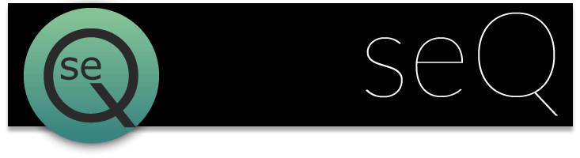
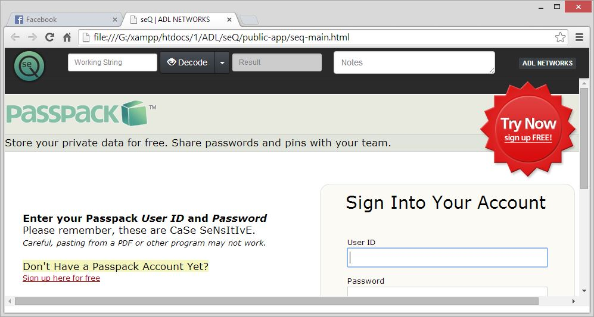

# seQ
ADL NETWORKS Security App

## Table of contents

 - [Preview](#Preview)
 - [Setup](#setup)
 - [Requirements](#requirements)
 - [What's included](#What's-included)
 - [Documentation](#documentation) 
 - [Branches](#branches)
 - [Versioning](#versioning)
 - [Author](#author)
 - [Only ADL] (#only-adl)
 - [Copyright and licence](#copyright-and-licence)

## Preview

You can also find these preview ScrenShots  *preview* folder


## Setup

Quick start options are available:

- Download the latest release.
- Clone the repo: `git clone https://github.com/adlnetworks/seq.git`.

## Requirements

* **Modern Browser**: a modern browser (like Chrome) is required to run

### What's included

Within the download you'll find the following directories (and files), logically grouping common assets. You'll see something like this:

```
├───img
│   ├───graphics-src
│   └───preview
├───old
└───public-app
    └───assets
        ├───app
        ├───css
        ├───fonts
        ├───img
        ├───js
        ├───plugins
        │   ├───bootswatch
        │   ├───jquery
        │   └───jquery-frame
        └───runjs
```

Sometimes is compiled and minified CSS and JS (`file.min.*`).

## Documentation

This is a Bootstrap based project. Bootstrap's documentation, is publicly hosted on GitHub Pages at <http://getbootstrap.com>.

## Branches

  * **Master:** *Production* release app
  * **Dev:** *Development* Current working.

## Versioning

For transparency into our release cycle and in striving to maintain backward compatibility, this project is maintained under the Semantic Versioning guidelines. 

Releases will be numbered with the following format:

`<major>.<minor>.<patch>`

And constructed with the following guidelines:

- Breaking backward compatibility **bumps the major** while resetting minor and patch
- New additions without breaking backward compatibility **bumps the minor** while resetting the patch
- Bug fixes and misc changes **bumps only the patch**

For more information on SemVer, please visit <http://semver.org/>.


## Author

**Adalberto Vargas**

- <http://www.adalbertovargas.com/>

### Hire me

I'm available for freelance work. Remote worldwide or locally around Guadalajara, Mexico & Monterrey. Mail me if you like: contacto@adalbertovargas.com

#### Only ADL

Local Working Dir
```
:/xampp/htdocs/1/ADL/seq
```
## Copyright and license


Copyright 2014 [ADL NETWORKS](https://www.adlnetworks.com), S.A.

Code Licensed under [MIT](http://www.opensource.org/licenses/mit-license.php). Totally free for private or commercial projects.